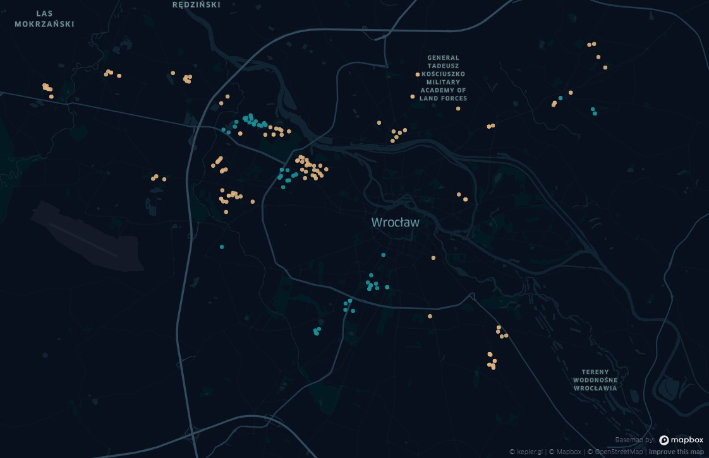

# PCK Wrocław

### This repository contains [the map](./pck.html) for clothing containers for `Wrocław, Poland`. [Data](https://www.pck.pl/tekstylia/files/WYKAZ%20PCK%20ODDZIA%C5%81%20WROC%C5%81AW%20402%20;%2016.02.2018.pdf) was taken from the official [PCK](https://www.pck.pl/tekstylia/) site. There are 2 layers: 
* `PCK` - relates to the first table
* `PCK_500` - relates to the second table

# License
See [LICENSE.md](./LICENSE.md)